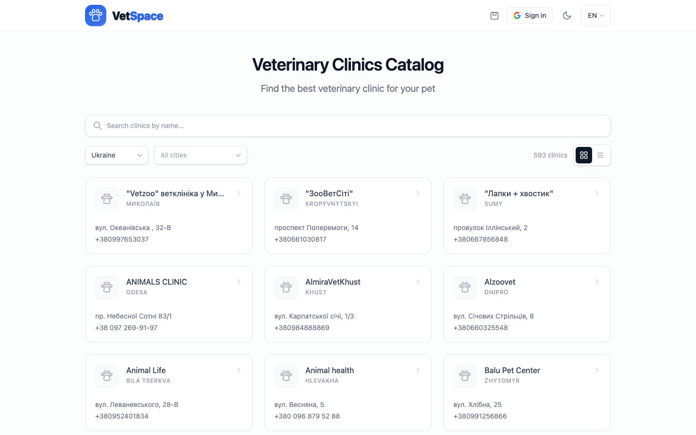
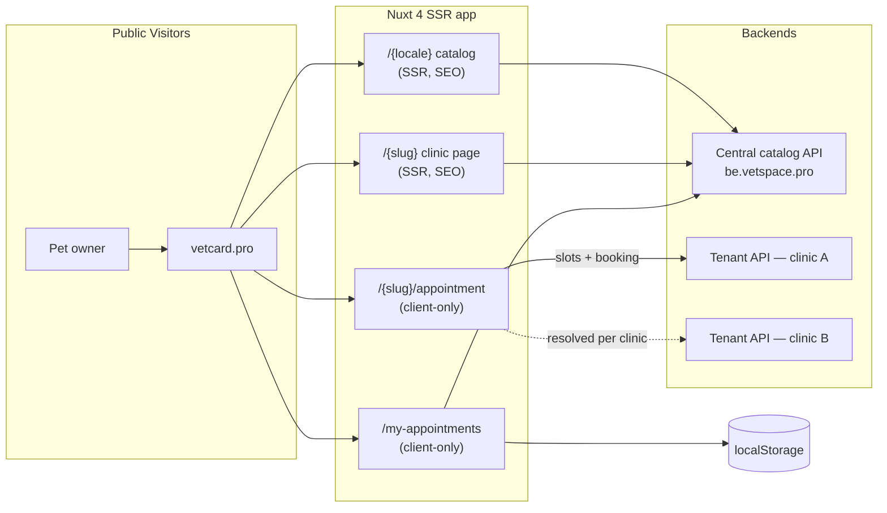
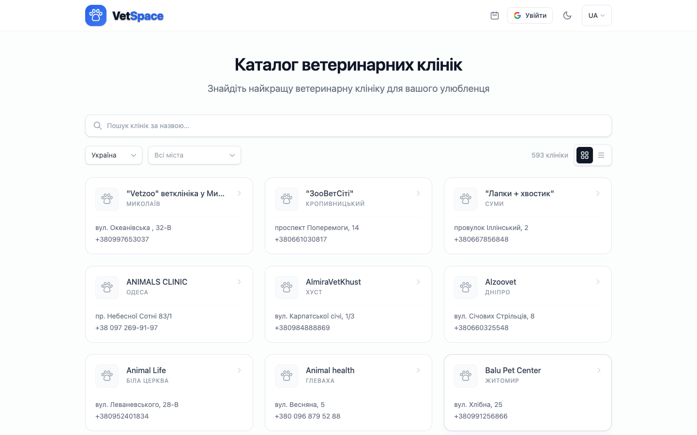
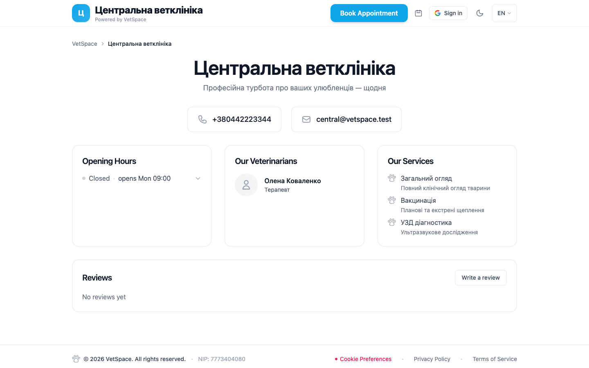
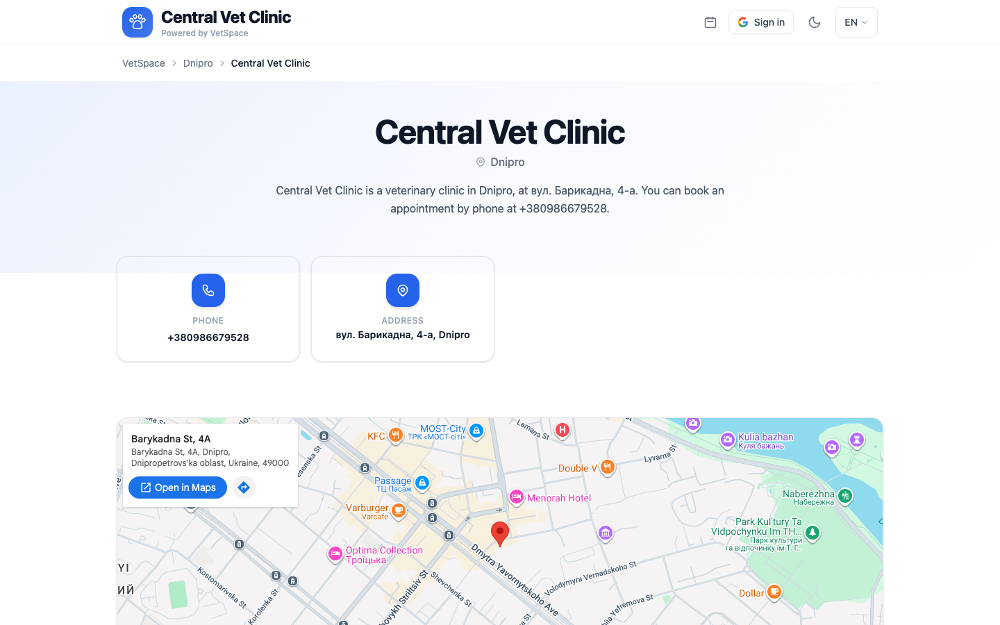
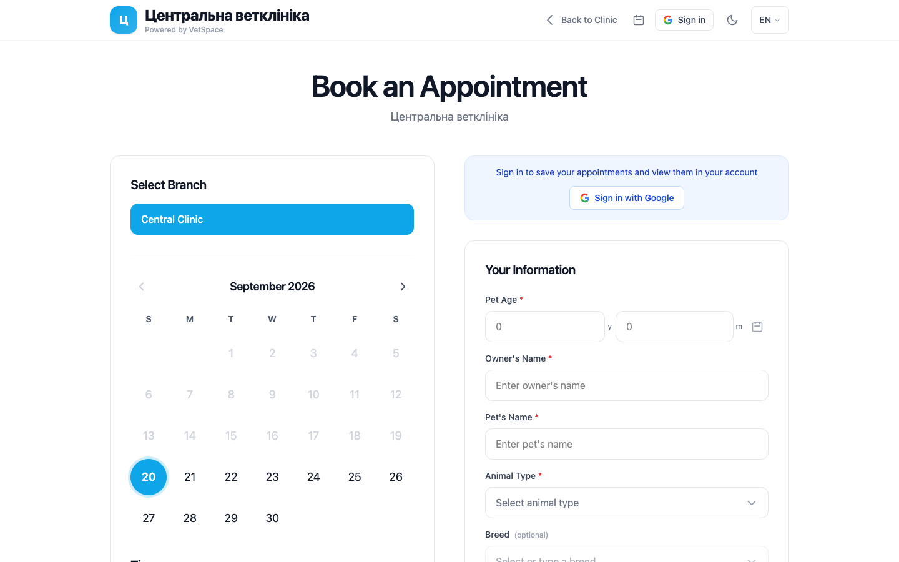

# VetCard — Public Clinic Portal

> **The source code is private.** This repository is a public technical overview — architecture, domain specifications in OpenSpec format, and screenshots of the live application.

**VetCard** is the public-facing frontend of the VetSpace platform — a multi-tenant Nuxt 4 application that serves a searchable catalog of veterinary clinics, per-clinic branded micro-sites, and account-free online appointment booking.

- **Production:** [vetcard.pro](https://vetcard.pro)
- **Staging:** [vet-card.digispace.pro](https://vet-card.digispace.pro)
- Companion repositories: [vetspace-api](https://github.com/Yurij2015/vetspace-api) (backend) · [vetspace-frontend](https://github.com/Yurij2015/vetspace-frontend) (clinic CRM panel)



## What it does

- **Clinic catalog** — SSR, SEO-indexed directory (590+ clinics in production) with search, country/city filters, verified badges, grid/list views
- **VetCard pages** — per-clinic branded pages at `/{slug}`: clinic's own logo, theme color, doctors, services, opening hours, photo gallery, reviews, map — themed entirely from the clinic's brand color
- **Online booking** — account-free appointment flow at `/{slug}/appointment`: branch selection, date picking, live slot availability with scarcity badges, Cloudflare Turnstile bot protection
- **Guest appointment management** — visitors find and cancel their bookings via `localStorage` + phone-number verification; signed-in owners (Google OAuth) see cross-device history
- **Clinic claim flow** — "Is this your clinic?" CTA on basic listings converts catalog entries into paying tenants
- **Multi-branch support** — `?branch=<id>` switches address, hours, doctors and booking scope; each branch is its own catalog row

## Architecture



The key design decision: **one deployment serves every tenant**. The booking flow resolves each clinic's tenant domain at runtime from the clinic payload and talks directly to that tenant's API — no per-tenant builds, no shared booking state.

SSR is applied surgically: catalog and clinic pages render server-side for SEO, while booking and my-appointments are client-only (`ssr: false`) because they depend on `localStorage` and calendar state — avoiding hydration mismatches by design.

## Tech stack

| Layer | Tech |
|---|---|
| Framework | Nuxt 4, Vue 3, TypeScript (SSR) |
| Styling | Tailwind CSS v4 (`@tailwindcss/vite`) |
| i18n | `@nuxtjs/i18n` — uk / en / pl, locale-prefixed routes |
| SEO | `@nuxtjs/seo`, JSON-LD, per-locale sitemap + canonical links |
| Bot protection | Cloudflare Turnstile (`@nuxtjs/turnstile`) |
| Monitoring | Sentry (`@sentry/nuxt`) |
| Media | `@nuxt/image`, QR-code generation for clinic cards |
| Testing | Vitest (unit) + Cypress (e2e against a real backend) |

## Screenshots

### Clinic catalog (production)

| | |
|---|---|
|  |  |

### VetCard clinic page

A branded clinic micro-site. **Demo data:** the premium clinic shown here ("Центральна ветклініка") is a synthetic demo tenant on staging — the name, doctor, services, phone and email were created purely for illustration and belong to no real business.

| | |
|---|---|
|  |  |
|  | |

### Booking flow

| | |
|---|---|
|  | |

Catalog and basic listing captured on production; the branded VetCard page and booking flow on staging (a seeded demo clinic — synthetic contacts only).

## Repository layout

```
openspec/specs/       Behavioural specs (OpenSpec / OKF format)
  architecture/       System overview, rendering strategy
  catalog/            Clinic directory, country filter
  booking/            Booking flow, Turnstile protection
  my-appointments/    Guest cancellation, local cache scoping
  seo/                Hydration & indexing, sitemap
docs/screenshots/     Live app screenshots (staging + production)
```

## Status

Portfolio / documentation repository. Application source code is private.

---

## Explore & contact

- **Live:** [vetcard.pro](https://vetcard.pro) — the catalog is public, browse it
- **Companion repos:** [vetspace-api](https://github.com/Yurij2015/vetspace-api) · [vetspace-frontend](https://github.com/Yurij2015/vetspace-frontend)
- **Author:** Yurii M — [portfolio](https://yuriimokryi.vercel.app/) · [GitHub](https://github.com/Yurij2015) · [LinkedIn](https://www.linkedin.com/in/yurii-mokryi/) · [Telegram](https://t.me/mokriy_yuriy)
